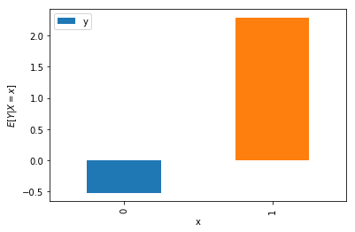
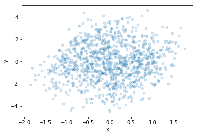
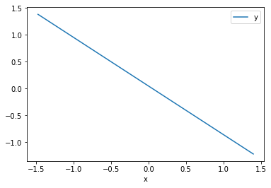
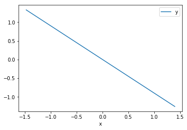
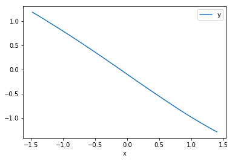
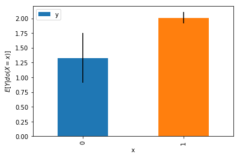
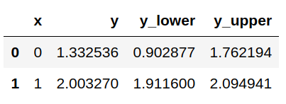
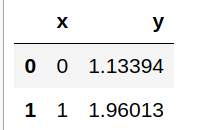

# Analysis

This module contains tools for using the Robin's G-Formula and arbitrary machine learning estimators to estimate and plot causal effects. By "causal effect" we mean the distribution or conditional expectation of Y given X, controlling for an admissable set of covariates, Z, to make the effect identifiable. For a primer on choosing these Z variables, check out the article [here](https://medium.com/@akelleh/a-technical-primer-on-causality-181db2575e41).

More intuitively, you want to estimate the effect of X on Y, but you know you need to control for some set of confounders, Z, to get the true effect. Otherwise, you expect there to be confounding bias.

# The `CausalDataFrame`

The `CausalDataFrame` is an extension of the `pandas.DataFrame`, so you can intialize it as you normally would intialize a `pandas.DataFrame`, e.g.

```python
import numpy as np
import pandas as pd
import matplotlib.pyplot as pp
from causality.analysis.dataframe import CausalDataFrame

N = 1000

z = np.random.normal(1., size=N)
x = np.random.binomial(1, p=1./(1. + np.exp(-z/.1)))
y = x + z + np.random.normal(size=N)

# It's easy to create a data frame
df = CausalDataFrame({'x': x, 'y': y, 'z': z})
```
Here, we've created a dataset where `x` has a direct effect on `y`, but a third variable `z` has a direct effect on both `x` and `y`. The result will be that when `z` is higher, both `x` and `y` will tend to be higher due to the influence of `z`. This correlation is not due to the causal dependence between `x` and `y`, and is instead due to confounding by `z`. We can make a causal plot that controls for `z` so we can see the true dependence between `x` and `y` easily with the `CausalDataFrame`:


```python
# and the interface to zplot is basically the same as the pandas.DataFrame.plot method!
df.zplot(x='x', y='y', z_types={'z': 'c'}, z=['z'], kind='bar', bootstrap_samples=500); pp.ylabel("$E[Y|do(X=x)]$"); pp.show()

```


This `zplot` method passes args and kwargs to the `plot` method of the `pandas.DataFrame`, so you can pass it all of its usual formatting options. We'll give a more complete summary of all of its particular methods below.

 You can also still use all of the usual `DataFrame` methods, for example to get a naive plot for comparison.

 ```python
df.groupby('x').mean().reset_index().plot(x='x', y='y', kind='bar'); pp.ylabel("$E[Y|X=x]$"); pp.show()
 ```
 

The correct answer in this example is that if you intervene to set the value of `x` to `x=0`, you'll find (on average) `y=1`. If you set `x=1`, you'll find (on average) `y=2`. You can see the causal `zplot` method finds the correct answer, within the 95% confidence level. You can see naive observational estimate has much lower `y` at `x=0`!

## The `CausalDataFrame.zplot` method

If you have continous `x`, you can instead use the `kind='line'` argument. Let's generate a similar data set to see how this works. This time, let's have two confounding variables.

```python
N = 1000
lower = -1
upper = 1
z1 = np.random.uniform(lower, upper, size=N)
z2 = np.random.uniform(lower, upper, size=N)
x  = np.random.uniform(lower, upper, size=N) + (z1 + z2)/2.
z  = z1 + z2
y  = np.random.normal(size=N) - x + 2.* z
X  = CausalDataFrame({'x': x, 'y': y, 'z1': z1, 'z2': z2})
```
We can see from this data generating process that the true relationship, holding the confounders `z` constant, is a negative relationship between `x` and `y` that is linear with a slope of `-1`. If we just plot the (confounded) data, we can't see any relationship at all:

```python
X.plot(x='x', y='y', style='bo', alpha=0.2, kind='scatter')
```
 

We can control for the `z` variables, and recover the negative relationship!

```python
X.zplot(x='x', y='y', z=['z1', 'z2'], z_types={'z1': 'c', 'z2': 'c'}, kind='line')
```
 

 Unfortunately, the relationship is very noisy. The model used by default to do the controlling is a random forest model. It won't be the best model for every problem, and doesn't work here as well as kernel regression. Those are the two typed models that are currently supported for automatic controlling. You can switch to kernel density regression by specifying `model_type='kernel'`.

```python
X.zplot(x='x', y='y', z=['z1', 'z2'], z_types={'z1': 'c', 'z2': 'c'}, kind='line', model_type='kernel')
```
 

 You're free to use other models you define yourself, as well. The models can be fitted or not. If the model is not fitted, you should pass the model object through the `model` kwarg.

 ```python
 from sklearn.linear_model import LinearRegression

treatment = 'x'
outcome = 'y'
confounders = ['z1', 'z2']
X.zplot(x='x', y='y', z=confounders, z_types={'z1': 'c', 'z2': 'c'}, kind='line', model=LinearRegression)
```



If you'd like to pass a fit model, for example as you might if you're fitting a complicated model like a neural network, you can pass it through the `fitted_model` kwarg. Here's a simple multi-layer perceptron, just to give an example.

```python
from sklearn.neural_network import MLPRegressor
model = MLPRegressor(hidden_layer_sizes=(128,128,128), max_iter=100, learning_rate_init=0.01)

treatment = 'x'
outcome = 'y'
confounders = ['z1', 'z2']
model.fit(X[[treatment] + confounders], X[outcome])
# requirement: model.predict(X[[treatment] + confounders]) yields a numpy array of scalar predictions for y, dimension (n_samples,)
X.zplot(x='x', y='y', z=confounders, z_types={'z1': 'c', 'z2': 'c'}, kind='line', fitted_model=model)
```



With discrete variables, it's a little easier to bootstrap error bars. We have some kwargs available to give a little extra control over the bootstrapping process. Note that we use the normal approximation for the bootstrap confidence intervals. Using the percentile approach tended to give overly narrow intervals.

Returning to the discrete data example from before,
```python
N = 1000

z = np.random.normal(1., size=N)
x = np.random.binomial(1, p=1./(1. + np.exp(-z/.1)))
y = x + z + np.random.normal(size=N)

# It's easy to create a data frame
df = CausalDataFrame({'x': x, 'y': y, 'z': z})

# and the interface to zplot is basically the same as the pandas.DataFrame.plot method!
df.zplot(x='x', y='y', z_types={'z': 'c'}, z=['z'], kind='bar', bootstrap_samples=500); pp.ylabel("$E[Y|do(X=x)]$"); pp.show()
```


The default number of samples for the bootstrap is 500 samples. Much less than that tended to give overly narrow intervals. I'd encourage you to test them yourself with a simulation if you're planning to vary this parameter!

You can also adjust the confidence level for your error bars. The default is the 95% confidence level. As we decrease the confidence level, you'll see the error bars shrink.
```
df.zplot(x='x', y='y', z=['z'], z_types={'z': 'c'}, kind='bar', bootstrap_samples=500, confidence_level=0.80)
```


You might also like to just get the values and error bars out from these plots. You can do that for the discrete plot with the `zmean` method.

## The `CausalDataFrame.zmean` method

The interface for the `zmean` method is exactly like the `zplot` method. You can pass models and bootstrap parameters in the same way. The return value is a new dataframe.

```python
df.zmean(x='x', y='y', z=['z'], z_types={'z': 'c'}, bootstrap_samples=500, confidence_level=0.95)
```


Leaving off the `bootstrap_samples` kwarg while specifying the `confidence_level` will cause `zmean` to default to `bootstrap_samples=500`. Leaving off both keyword arguments will result in no confidence intervals being given:
```python
df.zmean(x='x', y='y', z=['z'], z_types={'z': 'c'})
```

