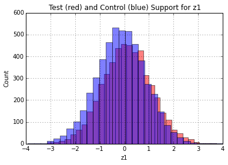
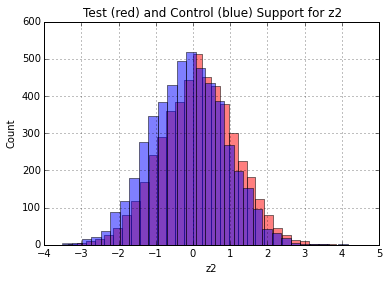
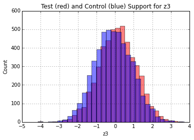

# causality.estimation

This module is for causal effect estimation! When you run a randomized controlled experiment (e.g. an A/B test), you know that people in the test group are, on average, similar to people in the control group. For any given covariate, Z, you expect that the average of Z in each group is the same. 

When you only have observational data, you can't be sure that the group assignments are independent of other covariates. The worst case scenario is that the effect of the treatment is different between the test and the control group. Then, the treatment's effect on the test group no longer represents the average effect of the treatment over everyone. 

In a drug trial, for example, people might take the drug if they've taken it in the past and know it works, and might not take it if they've taken it before and found that it doesn't work. Then, you'll find that the drug is much more effective for people who normally take it (your observational test group) than people who don't normally take it. If you enacted a policy where everyone who gets sick gets the drug, then you'll find it much less effective on average than it would have appeared from your observational data: your controlled intervention not gives the treatment to people it has no effect on!

Our goal, then, is to take observational data and be able to answer questions about controlled interventions. There are some excellent books on the subject if you're interested in all of the details of how these methods work, but this package's documentation will give high-level explanations with a focus on application. Some excellent references for more depth are Morgan and Winship's [_Counterfactuals and Causal Inference_](https://www.amazon.com/Counterfactuals-Causal-Inference-Principles-Analytical/dp/1107694167), Hernan's [_Causal Inference_](https://www.hsph.harvard.edu/miguel-hernan/causal-inference-book/), Pearl's groundbreaking (but extremely difficult, and not application-focused) [_Causality_] (https://www.amazon.com/Causality-Reasoning-Inference-Judea-Pearl/dp/052189560X), or Imbens and Rubin's [_Causal Inference_](https://www.amazon.com/Causal-Inference-Statistics-Biomedical-Sciences/dp/0521885884/ref=sr_1_1?s=books&ie=UTF8&qid=1496343137&sr=1-1&keywords=imbens+and+rubin).  

There are some critical caveats to all of these approaches. First, if you don't know what variables to control for, you're often out of luck. This is true of all methods that rely on controlling. Other methods, like Instrumental Variables, or mechanism-based methods, get around this by instead making certain assumptions about the structure of the system you're studying. We'll make a note of which type of algorithm you're dealing with in the tutorial for that algorithm, but it should be relatively clear from the context. This distinction is a little artificial, since you can often do controlling alongside approaches that rely on structural assumptions.


## Sub-modules:
### parametric
Most of the classic models you'd like to use are probably in this portion of the package. Currently, these include propensity score matching and difference-in-differences. 

#### PropensityScoreMatching

Propensity score matching tries to attack the problem of dissimilar test and control groups directly. You have the option of making the test group more similar to the control group, or vice versa. When we're talking about similarity, we mean similar by some metric. In the case of propensity score matching, that metric is the "propensity score". The propensity score is the probability a unit is assigned to the treatment given a set of covariates, $$P(D|Z_1, Z_2, ..., Z_n)$$. We can use a specific example to make all of this concrete. We'll run through the example for a high-level explanation, and then go in-depth into the assumptions and caveats.

##### High-level Example

Suppose we're in the publishing business, and we're interested in the effect of "the length of an article title" on "the click-through rate of the article" (the proportion of times when a link to an article is seen and also clicked). To make things really simple, we'll just consider "long" titles and "short" titles. We're interested in how much better a long title clicks than a short title.

There's a big problem: we can't force our writers to make their titles a certain length. Even worse, we think that our better writers tend to write longer titles. Since they're better writers, their titles also tend to click better _independently from the effects of the length of the title on click-through rates_. This results in a correlation between title length and click-through rates, even if there is no causal effect! They are both caused by the author.

In order to handle this, we can try to control for the effect of the author. There's a direct way to do this, by looking at the effect of title length on click-through rates for each author, and then averaging over authors. That way, each effect measurement controls for author, and you average the effect measurements together to get the total result. This easy to do when we only care about one variable, but usually we want to control for a lot more. Consider that the vertical (e.g. news, entertainment, etc.) the author writes for might also confound the effect (e.g. news headlines might be longer, but also more interesting and so clickier). The more variables there are to control for, the harder it is to find data for every possible combination of values. This is where propensity score matching really shines: if you're willing to assume a model for the propensity scores, then you can do this kind of controlling. In this package, we build in a logistic regression model. In general, you can use any model you like.

In order to use this package, the simplest implementation assumes you have all of the relevant data in a pandas.DataFrame object, `X`. We'll have author names as strings in `X['author']`, title length as `0` for short, and `1` for long in `X['title_length']`, vertical in `X['vertical']`, and the outcome we're interested in, the click-through rate (CTR) in `X['ctr']`.

Estimating the effect is as simple as 
```python
from causality.estimation.parametric import PropensityScoreMatching

matcher = PropensityScoreMatching()
matcher.estimate_ATE(X, 'title_length', 'ctr', {'author': 'u', 'vertical': 'u'})
```

The first argument contains your data, the second is the name of the dataframe column with the "cause" (must be binary for PSM, but there's a little flexibility on how you encode it. Check the docstring for details.), the 3rd argument is the name of the outcome. The 4th argument is a dictionary that tells the algorithm what you'd like to control for. It needs to know whether your data is discrete or continuous, so the values of the dictionary are `'c'` for continuous, `'o'` for ordered and discrete, and `'u'` for unordered and discrete. 

The name `ATE` stands for "average treatment effect". It means the average benefit of the `1`  state over the `0` state. 

Now, we'll do a more in-depth example which will involve examining whether a few assumptions we make with PSM are satisfied, and we'll see how to get confidence intervals.

##### Detailed Example

Propensity score matching does a lot of work internally. It attempts to find treatment and control units who are similar to each other, so any differences in them can be attributed to the difference treatment assignments. We're making a few assumptions here. The most critical is probably that we've controlled for all of the variables that say whether two units are "similar enough" to be matched together. There is a very technical criterion called the ["back-door criterion"](http://bayes.cs.ucla.edu/BOOK-2K/ch3-3.pdf) (BDC) that answers this question. It's impossible to check without doing an experiment. This is a common problem with using observational data. For this reason, most methods are really just "best guesses" of the true results. Generally, you hope that controlling for more things removes bias, but even this isn't guaranteed.

There are, however, a few diagnostics that help you figure out whether you've done a good job matching. Once you've done the matching, the distribution of the Z's between the test and control should end up pretty similar. The easiest trick is probably to examine the average value of each Z between the test and control group, and make sure most of the difference is gone. If so, your matching is probably okay. If not, you should play with the matching algorithm's parameters and try to do a better job. This works well in practice, but it has been noted that you [can actually increase imbalance using PSM](https://gking.harvard.edu/files/gking/files/psnot.pdf). What you really care about is that you have controlled for all the relevant variables, and that the propensity scores are balanced. These scores satisfy the BDC if the variables that generate them do, and if the model used to estimate them is correct. Thus, controlling for propensity scores, if your modeling assumptions are correct, is sufficient.

Let's run through a quick example of propensity score matching to see how easy it can be!

First, we need to generate a data set that has some bias, since we're dealing with observational data. This will simulate an observational data set where the treatment's effectiveness varies depending on some other variables, Z. These will also correlate with whether a unit is assigned to the treatment or control group.

First, lets's generate our Z variables. These are analogous to "vertical" and "author" from the simple example before. Here, we'll make them continuous.'

```python
import pandas as pd
import numpy as np
from causality.estimation.parametric import PropensityScoreMatching

N = 10000
z1 = np.random.normal(size=N)
z2 = np.random.normal(size=N)
z3 = np.random.normal(size=N)
```

Next, we want to define the variable that is analogous to "long" or "short" title. We want someone to be more likely to use a long title if the Z variables are higher, so we'll make the probability of `d=1` higher if any Z is higher, using a logistic function.

```python
p_d = 1. / (1. + np.exp(-(z1 + z2 + z3)/4.))
d = np.random.binomial(1, p=p_d)
```

So people use long titles with a probability `p_d`.


Next, we want to define our outcomes. We'll call these `y`. Before, these were just CTRs, so they were between 0 and 1. Now, they'll be real-valued. To make the effect of the treatment really explicit, we'll explicitly define the outcome for each unit in the case theat they're assigned to the `d=1` state, `y1`, or the `d=0` state, `y0`. These variables are called the "potential outcomes". They are the outcomes that are possible for each unit, depending on the `d` variable. `d` is often called the "treatment assignment," since the effect we're looking for is actually the result of an imaginary completely randomized experiment, where we randomized assigning some articles to having long titles, and others to having short titles.

The `d=0` outcome will be normal random. This is the baseline success for each article title. The `d=1` state will be the `d=0` state plus a difference that depends on the `z` variables.

```python
y0 = np.random.normal()
y1 = y0 + z1 + z2 + z3
```
The difference between these is just `z1 + z2 + z3`. This is a weird effect. It says that if an article has a long title, then it will perform `z1 + z2 + z3` better than if the article has a short title, everything else held fixed. The weirdness here is the dependence on the Z variables: people with higher Z tend to write better long titles than people with lower Z. If some of these Z variables represent the skill of the author, then we interpret this as "when a skillful author writes a longer title, it tends to perform better than when they write a short title by and amount that depends on the author's skill.". 

Now, we just need to define the actual measured outcome. The `d` variable chooses whether each article has a long or short title, so it chooses between the `y0` and `y1` outcomes. We'll put it all together into a dataframe.

```python
y = (d==1)*y1 + (d==0)*y0

X = pd.DataFrame({'d': d, 'z1': z1, 'z2': z2, 'z3': z3, 'y': y, 'y0': y0, 'y1': y1, 'p': p_d})
```

The variable `y0` is the value that `y` would take if the unit is in the control group. The variable `y1` is the value the unit would take if it were in the test group. A unit can only be in one group when you measure its outcome, so you can only measure `y = y0`` or `y = y1`` in practice. Normally, you can't observe the potential outcomes. The only reason we have them here is because we wrote the data-generating process.  
 
Notice that these Z variables determine both whether a unit will be assigned to the `d=0` or `d=1` state (the higher the `z`s are, the higher `p_d` is), and they also determine the size of the outcome (the difference is just the sum of the `z`s, so higher `z` means higher treatment effectiveness.).  This results in bias if you just use a naive estimate for the average treatment effectiveness:

```python
> X[X['d'] == 1].mean()['y'] - X[X['d'] == 0].mean()['y']
0.3648
```
Taking a look at the true average treatment effect, the average difference between `(y1 - y0).mean()`, we can read off that it's just the average of `z1 + z2 + z3`. `z1 + z2 + z3` is the sum of three normal variables, so has mean zero. Thus, there is no average treatment effect! Our naive estimate of `0.36` is far from the true value. We can calculate the true value directly:
 
```python
> (y1 - y0).mean()
-0.0002
```
 
which is only different from zero due to sampling error.

Since we can't measure these potential outcome variables, we want to use PropensityScoreMatching to control for the variables that cause the bias. We can do this very easily!
```python
> matcher = PropensityScoreMatching()
> matcher.estimate_ATE(X, 'd', 'y', {'z1': 'c', 'z2': 'c', 'z3': 'c'})
-0.00011
```
and so we get the right average treatment effect (within measurement error). If you pass the argument `bootstrap=True` to the `estimate_ATE` method, it will return a 95\% confidence interval (bootstrap estimate) for the ATE. Bootstrap methods tend to be [conservative](https://www.ncbi.nlm.nih.gov/pmc/articles/PMC4260115/).

Here, we put in a dataframe, `X`, that contains a binary treatment assignment column, `'d'`, an outcome column, `'y'`, and a dictionary of variables to control for. The keys are the names of the columns to use for controlling, and the values are one of `('c', 'o', 'u')` corresponding to continuous, ordered discrete, or unordered discrete variables, respectively.
 
When you pass these arguments, the method builds a logistic regression model using the control variables to predict treatment assignment. The probabilities of treatment assingment, a.k.a. propensity scores, are used to match the treatment and control units using nearest neighbors (with a heuristic to improve matching for discrete variables). The matches are then used to calculate treatment effects on typical treated individuals, and typical control individuals, and then these effects are weighted and averaged to get the averate treatment effect on the whole population. This should agree with the value (within sampling error) of `(y1 - y0).mean()`, which is what we were trying to calculate!

There are a few critical assumptions to make sure your model gives a good estimate of the true average treatment effect (ATE). 

1. You must control for common causes of treatment status and the outcome (more precisely, a minimal set of common causes satisfying "the back-door criterion", see Pearl's book [here](http://bayes.cs.ucla.edu/BOOK-2K/ch3-3.pdf)). This can be the biggest show-stopper, because you may not know what all the common causes are, and you may not have them measured even if you do know.
2. The propensity score model (by default, logistic regression) must be the right model for the propensity scores. Misspecification (e.g. non-linearity, or even a different link function) will lead to systematic error in propensity scores, which can hurt the quality of your matching. 
3. The true propensity scores must be "probabilistic", and not deterministic. In other words, they must be strictly between 0 and 1 (and not equal to zero or one).
4. The test and control group must have the same support over the Z variables. If there are regions of Z where there are test units, but not control units, you can't estimate the average treatment effect, but might still be able to get a conditional average treatment effect. See Morgan and Winship's discussion in the book mentioned above for more details.

###### Checking the Common Support
Assuming these are satisfied, we can at least check that our matching does what we're expecting. First, a requirement of PSM is that the covariates overlap. You should technically check this for the `N` dimensional space of all `N` of your covariates, but we make it easy to check the `1-D` subspaces. Run

```python 
matcher.check_support(X, 'd', {'z1': 'c', 'z2': 'c', 'z3': 'c'})
```

And you'll find the following plots





You can see visually that the distributions overlap well on the x-axis. Thus, the Z's (at least in 1-D) share a common support, and the assumption is satisfied.

###### Checking Covariate Balance

If the matching we're doing does a good job of making the test and control groups "look like" each other in terms of the `Z` variables, then we should find that statistics of the `Z` variables between the test and control groups are the same. This isn't actually a requirement of PSM, but if the test and ctontrol are balanced on `Z`, then they should be balanced on the propensity scores. We have a handy tool for checking balance.

```python
matcher.assess_balance(X, 'd', {'z1': 'c', 'z2': 'c', 'z3': 'c'})
```

will return 

```python
{'z1': 0.2458132624378607,
 'z2': 0.26803071286101415,
 'z3': 0.22545847989783488}
```
 
so there is a fair amount of imbalance before matching. Next, we can get matched test and control groups. First, we need to generate the propensity scores,

```python
X = matcher.score(X, assignment='d', confounder_types={'z1': 'c', 'z2': 'c', 'z3': 'c'})
```

so now we have a new column in `X` labelled `propensity score`. Now, we'll run the matching

```python
treated, control = matcher.match(X, assignment='d')
```

and finally re-assess the balance after matching

```python
matcher.assess_balance(treated.append(control), 'd', {'z1': 'c', 'z2': 'c', 'z3': 'c'})
{'z1': 0.00031457811654961971,
 'z2': 0.01274281423785816,
 'z3': -0.01515794796420316}
```

Note that you can use this feature to assess balance on the propensity score after adding it to `X`,

```python
matcher.assess_balance(X, 'd', {'z1': 'c', 'z2': 'c', 'z3': 'c', 'propensity score': 'c'})
{'propensity score': 0.44348102876997414,
 'z1': 0.26127781471482076,
 'z2': 0.2577923164800251,
 'z3': 0.24351497330531932}
 
matcher.assess_balance(treated.append(control), 'd', {'z1': 'c', 'z2': 'c', 'z3': 'c', 'propensity score': 'c'})
 {'propensity score': 0.00067420782959645405,
  'z1': 4.3693151229817443e-05,
  'z2': -0.0044512025748346248,
  'z3': 0.006435102509766962}
```

so indeed we've done a good job of balancing the propensity scores between the groups.


### nonparametric
Documentation in progress!

### adjustments

Documentation in progress!